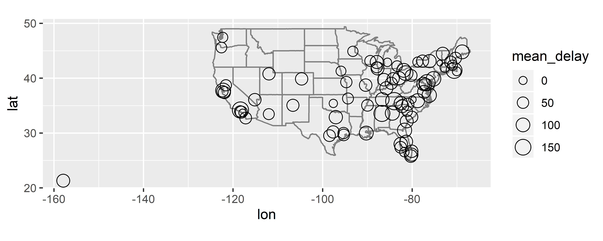

```{r setup, include=FALSE}
knitr::opts_chunk$set(echo = TRUE)
```

> 注意：请同学们在开始练习前记得先将本文档另存到其它文件夹下！

## 练习1. 了解数据集

首先，需要同学们加载R包并大致了解相关的数据集。

在下面 `R code chunk(R代码块)` 中键入代码，然后按 `Ctrl+Shift+Enter` 执行当前
代码块中的代码，依次完成如下练习：

1. 用 `library()` 命令载入代码练习所需用到 **`dplyr`** 包、**`ggplot2`** 包以及
**`nycflights13`** 数据包
2. 用 `help(package = "nycflights13")` 打开数据包帮助文档
3. 用 `?flights` 打开 flights（航班）数据集的帮助文档
4. 用 `print(flights)` 打印 flights 数据集
5. 用 `View(flights)` 在RStudio数据浏览窗口中打开 flights数据集


```{r data}
# 可在控制台Console键入qfwr::qfwr_key("L04", "ex1")查看参考答案
library(dplyr)


```


## 练习2. 数据筛选

找出出发延误至少1小时，但在飞行过程中补回至少30分钟的航班。

```{r filter}
# 代码模板
# ____(____, dep_delay >= 60, ____)
# 可在控制台Console键入qfwr::qfwr_key("L04", "ex2")查看参考答案


```


## 练习3. 选择变量并重命名

从 `flights` 数据集中选出变量 `year`、`month`、`day`、`dep_time` 和 `dep_delay`，
将前三个变量分别更名为 `nian`、`yue`、`ri`，并存为新数据集 `flights_sml`

```{r select}
# 可在控制台Console键入qfwr::qfwr_key("L04", "ex3")查看参考答案
# flights
# flights_sml <- ...

```


## 练习4. 修改数据

`flights` 数据集中现有的变量 `dep_time`、`sched_dep_time`、`arr_time`、
`sched_arr_time` 等的取值并不规范，请将它们“原地”修改为从午夜开始的分钟数，
并将修改后的数据存为 `flights_new`。

```{r mutate}
# flights
# 不难看出，这些变量的后两位数字为分钟，之前的一至两位数字为小时，
# 即1401表示14:01，想想有什么好办法可将它们拆解开。

# 可在控制台Console键入qfwr::qfwr_key("L04", "ex4")查看参考答案

# flights_new <- ...

```


## 练习5. 分组汇总

根据 `flights` 数据集分组汇总计算每日航班出发延误时间的中位数，存为新数据集
 `mdelay_by_day`（不使用管道操作符 `%>%`）。

```{r summarise, exercise=TRUE}
# 代码模板
# by_day <- ___(flights, ___, ___, ___)
# mdelay_by_day <- ___(by_day, mdelay = ___)
# 可在控制台Console键入qfwr::qfwr_key("L04", "ex5")查看参考答案

```


## 练习6. 航班平均延误时间的空间分布

作图显示2013年6月13日航班平均**到达**延误时间的空间分布情况


```{r join}
# 此题相对复杂些，可采取逐步运行的方法（输入部分代码，按▶查看结果）
# 代码模板
# flights %>%
#   ___ %>%       # 筛选数据
#   ___ %>%       # 分组
#   ___ %>%       # 计算汇总统计量
#   ___(airports, by = ___) %>%   # 生成性合并
#   ggplot(aes(lon, lat)) +
#   borders("state") +
#   geom_point(aes(size = mean_delay), shape = 1) +
#   coord_quickmap()
# 可在控制台Console键入qfwr::qfwr_key("L04", "ex6")查看参考答案


```


## 恭喜同学们，完成第四讲课后练习啦！

###           []~(￣▽￣)~*


